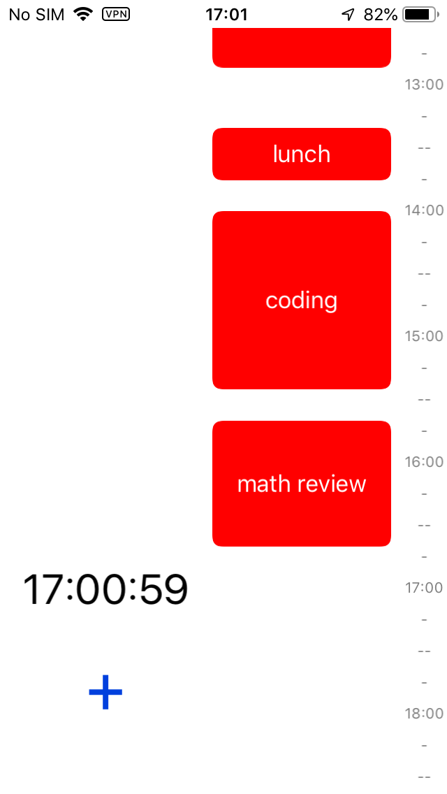

# timeonline
an iOS app that helps you track how you spend your time

     

## features of Cocoa Touch used in project:
- using ScrollView for displaying long list of user's jobs
- manually layouting UIViews in the scrollview to look good in almost any bounds
- use of custom views to that are responsible for displaying jobs (JobView)
- use of Timer to always show the current time to the user and also position it in the correct position of timeline (yes that clock moves down as the time goes on)
- Use of GestureRecognizers. tap anywhere in main view to get to current time. tap any white area to get rid of keyboard.

## features it misses right now:
- adding support for multiple days: now it just works for single day. I'm looking for a way to display some view to the user that makes more sense than a normal calendar because people might have different sleep times and calendar might miss many informations there
- storing the Done Jobs on the cloud and local storage. Unfortunately it doesn't store these info anywhere now.
- adding a custom View for the onGoing state that feels right for the user
